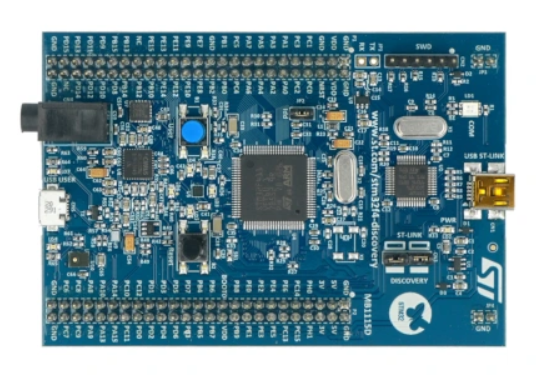
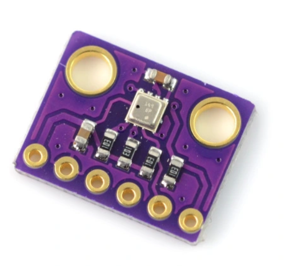
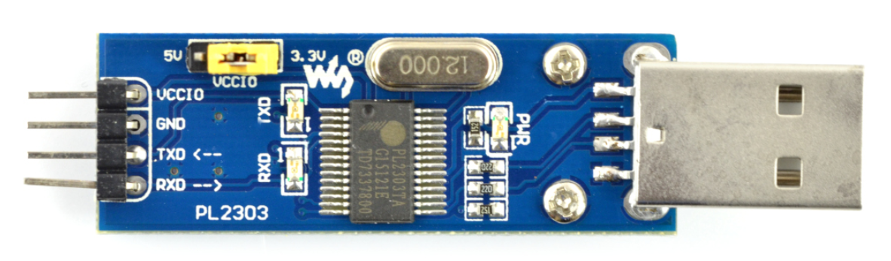

## Weather station
The purpose of this project was to create a weather station. The project is build on the STM32F411E Discovery development board. The BME280 sensor is used to acquire information 
about temperature, pressure and humidity. Communication between the microcontroller and the sensor is achieved using SPI. To show data to the user, the command line interface
based on UART was implemented. Buffering data using the ring buffer structure was implemented so that user can get both latest measurements and average measurements from last 3 
minutes. 

## Authors
* **Jan Kuliga**: [kuliga](https://github.com/kuliga)
* **Michał Tomacha**: [tomacha](https://github.com/tomacha)
* **Krzysztof Bera**: [krzysiubera](https://github.com/krzysiubera)

## Components used in the project:
- STM32F411E Discovery board

- BME280 sensor

- PL2303 USB-UART converter

